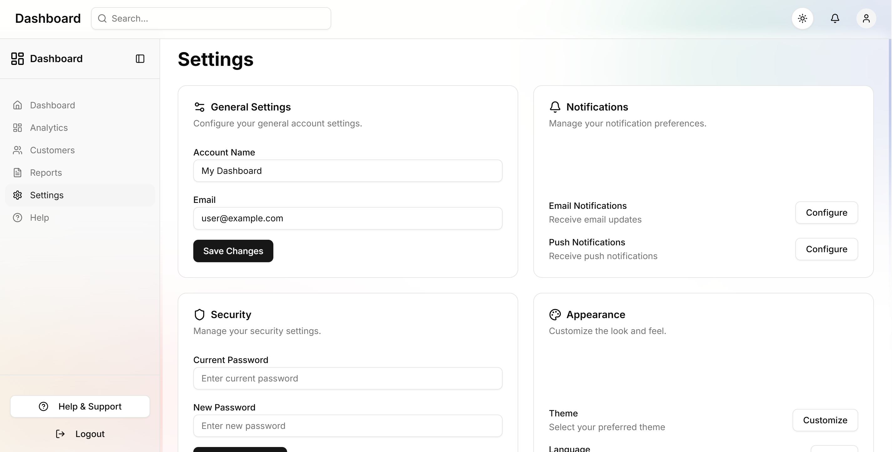
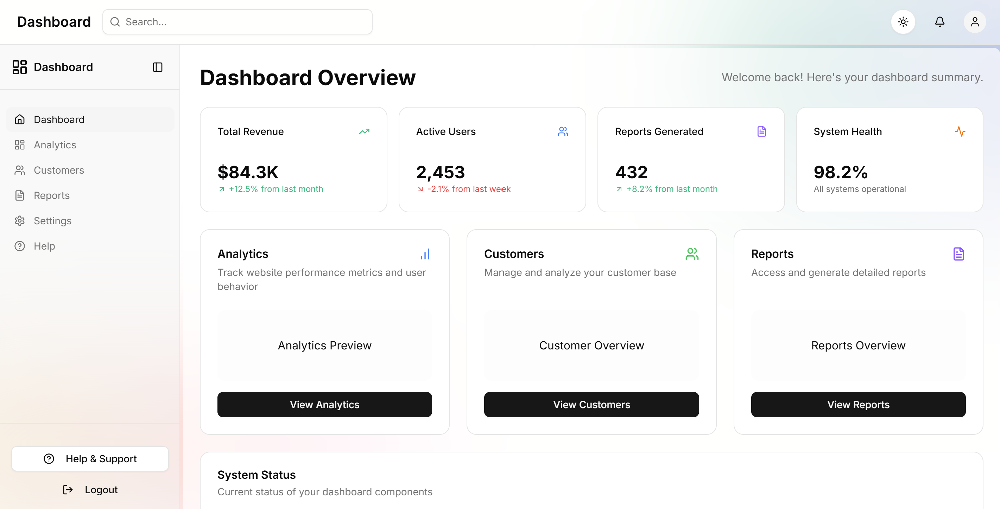
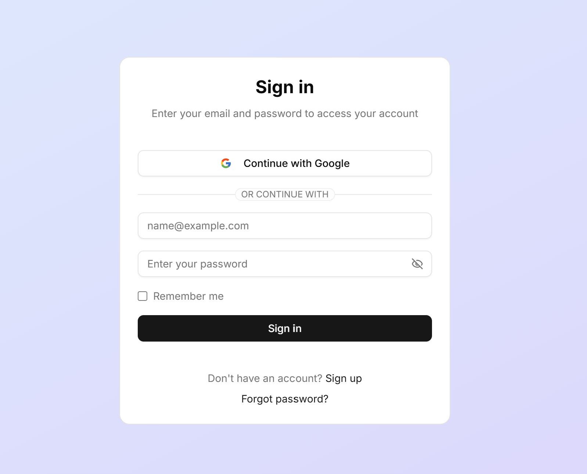
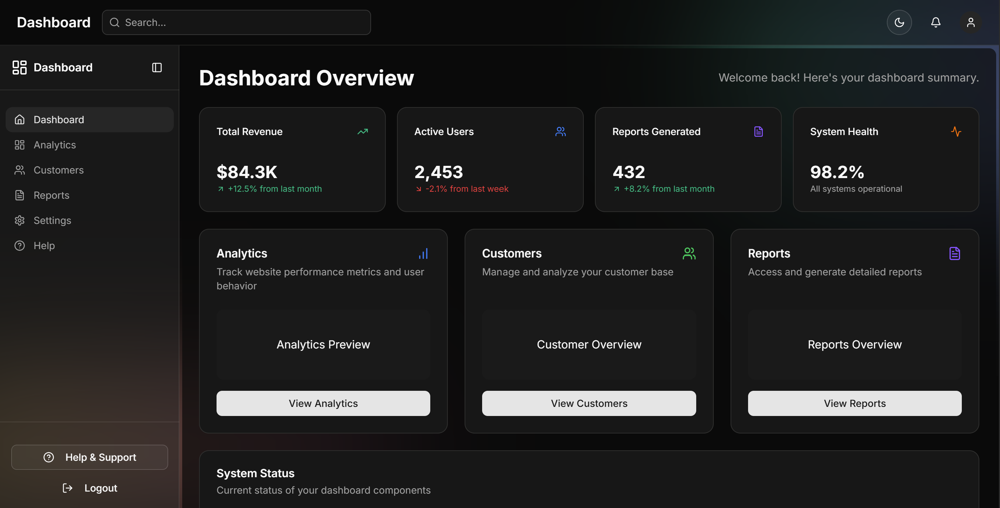
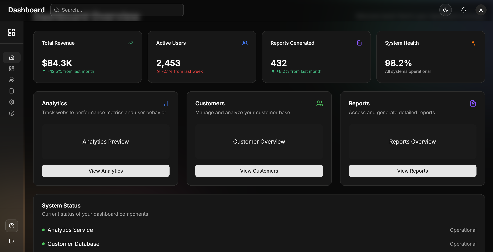
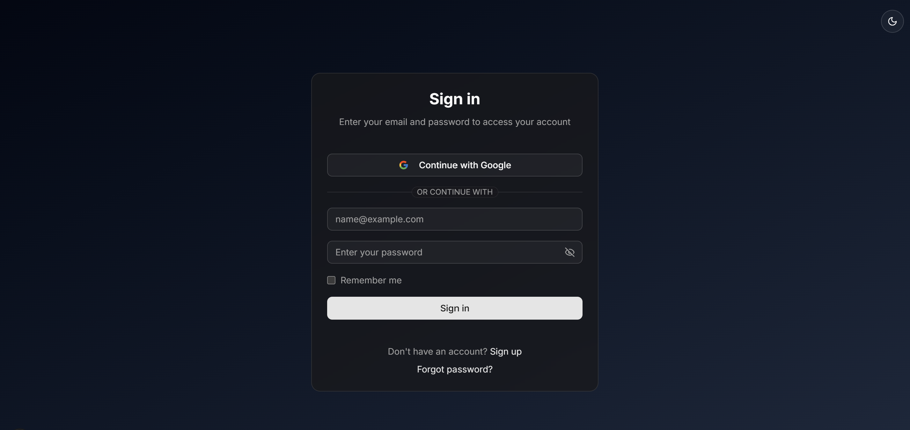
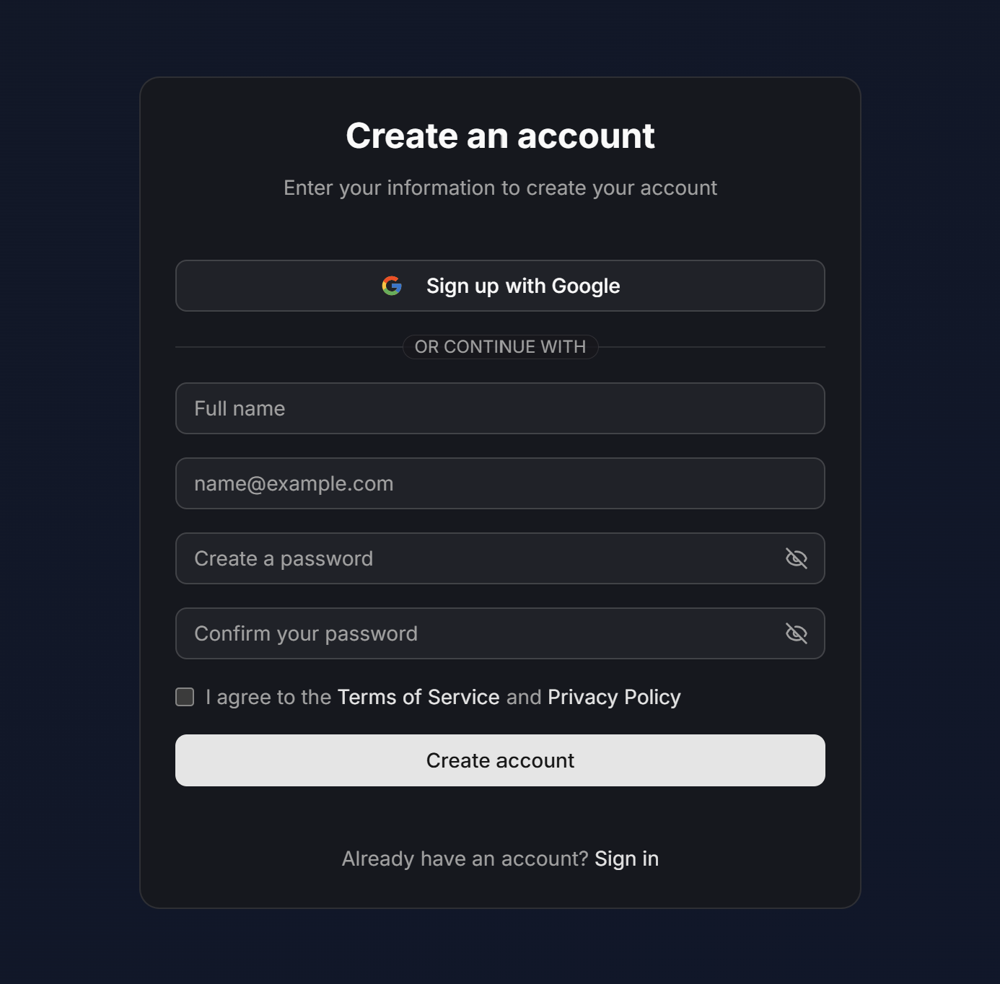

# Dashboard Template

<div align="center">
  


A modern, responsive dashboard template with authentication and dark mode
  
</div>

## ✨ Features

- 🔐 **Authentication** - NextAuth integration with Google OAuth
- 🎨 **Theming** - Light/Dark mode support
- 📱 **Responsive Design** - Optimized for all device sizes
- 🧩 **Modular Components** - Built with Shadcn UI
- ⚡ **Fast Performance** - Built on Next.js with App Router
- 🛠️ **TypeScript** - Type-safe development experience

## 📸 Screenshots
 - Light theme
<div align="center">
  
  
  
  
</div>

- Dark theme
<div align="center">
  
  
  
  
</div>

## 🚀 Pages

- **Authentication**
  - Login
  - Sign up
  
- **Dashboard**
  - Home - Overview of key metrics
  - Analytics - Detailed data visualizations
  - Customers - Customer management interface
  - Reports - Generated reports and downloads
  - Settings - User and application settings
  - Help - Support and documentation

## 💻 Tech Stack

- **Framework:** [Next.js 15](https://nextjs.org/)
- **UI Library:** [React 19](https://react.dev/)
- **Styling:** [Tailwind CSS 4](https://tailwindcss.com/)
- **Components:** [Shadcn UI](https://ui.shadcn.com/)
- **Authentication:** [NextAuth.js 5](https://next-auth.js.org/)
- **Form Handling:** [React Hook Form](https://react-hook-form.com/)
- **Validation:** [Zod](https://zod.dev/)
- **Icons:** [Lucide React](https://lucide.dev/), [React Icons](https://react-icons.github.io/react-icons/)

## 🛠️ Getting Started

### Prerequisites

- Node.js 18.17 or later
- npm or yarn

### Installation

1. Clone the repository

```bash
git clone https://github.com/AdiYd/dashboard.git
cd dashboard
```

2. Install dependencies

```bash
npm install
# or
yarn install
```

3. Create a `.env.local` file in the root directory with your NextAuth configuration

```
NEXTAUTH_URL=http://localhost:3000
NEXTAUTH_SECRET=your-secret-key
GOOGLE_CLIENT_ID=your-google-client-id
GOOGLE_CLIENT_SECRET=your-google-client-secret
```

4. Start the development server

```bash
npm run dev
# or
yarn dev
```

## 📁 Project Structure

```
dashboard/
├── public/
├── src/
│   ├── app/
│   │   ├── analytics/
│   │   ├── api/auth/[...nextauth]/
│   │   ├── customers/
│   │   ├── help/
│   │   ├── home/
│   │   ├── reports/
│   │   ├── settings/
│   │   ├── signup/
│   │   ├── globals.css
│   │   ├── layout.tsx
│   │   ├── not-found.tsx
│   │   └── page.tsx (Login)
│   ├── assets/
│   ├── auth/
│   ├── components/
│   │   ├── dashboard/
│   │   ├── ui/
│   │   └── theme-toggle.tsx
│   └── lib/
├── .env.local
├── next.config.js
├── package.json
└── tsconfig.json
```


## 🙏 Acknowledgements

- [Shadcn UI](https://ui.shadcn.com/) for the beautiful component library
- [Next.js Team](https://nextjs.org/) for the amazing framework